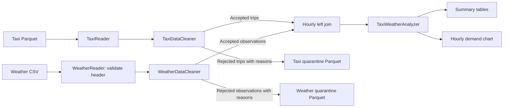
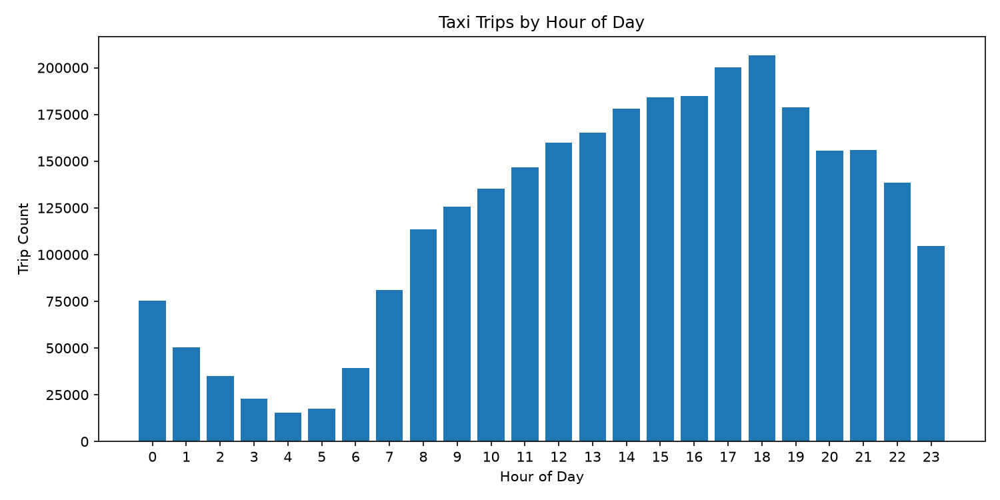
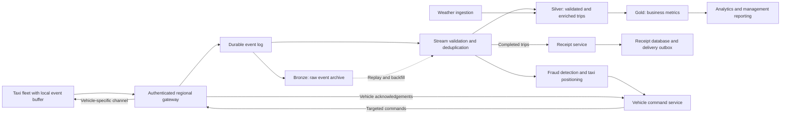

# Taxi Weather Pipeline

Small data engineering case study based on New York City taxi trip data and hourly weather data.

The goal is to demonstrate a simple and scalable data pipeline that:

- ingests taxi and weather data
- applies basic data quality rules
- standardizes timestamps
- joins taxi trips with hourly weather data
- performs a small analysis on taxi demand and weather conditions
- outlines how the local implementation could evolve into a production architecture

## Data Sources

### Taxi Data

New York City Yellow Taxi Trip Records for January 2024.

Source: [NYC Taxi & Limousine Commission trip records](https://www.nyc.gov/site/tlc/about/tlc-trip-record-data.page), using the [January 2024 Yellow Taxi Parquet file](https://d37ci6vzurychx.cloudfront.net/trip-data/yellow_tripdata_2024-01.parquet).

The dataset is stored locally as:

```text
data/raw/taxi/yellow_tripdata_2024-01.parquet
```

### Weather Data

Hourly weather data for New York City for January 2024.

Source: [Open-Meteo Historical Weather API](https://open-meteo.com/en/docs/historical-weather-api). The query uses latitude `40.7128`, longitude `-74.0060`, dates `2024-01-01` through `2024-02-01`, and timezone `America/New_York`. February 1 supplies the precipitation observation needed for the final January pickup hour. The response represents a nearby model grid cell; it is used as one citywide weather estimate, rather than weather measured at each pickup location.

The dataset contains:

- timestamp
- temperature
- precipitation
- weather code

The raw file is stored as:

```text
data/raw/weather/weather_january_2024.csv
```

## Project Structure

```text
taxi-weather-pipeline/
├── data/
│   ├── raw/
│   │   ├── taxi/
│   │   │   └── yellow_tripdata_2024-01.parquet
│   │   └── weather/
│   │       └── weather_january_2024.csv
│   ├── processed/
│   │   ├── rejected_taxi/
│   │   └── rejected_weather/
│   └── output/
│       ├── pipeline_summary.txt
│       └── trips_by_hour.png
│
├── src/
│   └── taxi_weather_pipeline/
│       ├── __init__.py
│       ├── analyzer.py
│       ├── data_cleaner.py
│       ├── data_joiner.py
│       ├── main.py
│       ├── taxi_reader.py
│       ├── visualizer.py
│       └── weather_reader.py
│
├── tests/
│   ├── conftest.py
│   ├── unit/
│   │   └── test_configuration.py
│   ├── component/
│   │   ├── test_analyzer.py
│   │   ├── test_data_cleaner.py
│   │   ├── test_data_joiner.py
│   │   ├── test_validation.py
│   │   ├── test_weather_calendar.py
│   │   └── test_weather_reader.py
│   └── integration/
│       └── test_pipeline.py
│
├── .gitignore
├── pyproject.toml
└── README.md
```

Each component has a single responsibility:

- `TaxiReader` reads taxi parquet data
- `WeatherReader` parses the weather source
- `TaxiDataCleaner` validates and cleans taxi records
- `WeatherDataCleaner` normalizes weather timestamps
- `TaxiWeatherJoiner` joins taxi trips with hourly weather
- `TaxiWeatherAnalyzer` creates simple analytical summaries
- `TaxiDemandVisualizer` saves the hourly demand chart
- `main.py` wires the pipeline components together

The pipeline prints its summaries, writes the chart, and persists rejected taxi and weather records as Parquet datasets in `data/processed/`. `pipeline_summary.txt` is a captured reference run; accepted enriched trips remain in memory during analysis and are not persisted.

## Local Data Processing Flow



## Data Quality Rules

### Taxi Data

The analysis includes trips with pickup times from `2024-01-01 00:00:00` inclusive to `2024-02-01 00:00:00` exclusive, in New York time. A January pickup can have a February dropoff if it passes the other rules.

Records are rejected when:

- pickup or dropoff timestamps are missing or invalid
- pickup is outside the analysis period
- trip duration is zero, negative, or longer than 24 hours
- distance is missing, non-finite, zero, negative, or greater than 200 miles
- average speed exceeds 100 mph, calculated as distance divided by elapsed hours
- total amount is missing, non-finite, or negative
- passenger count is present but non-finite or negative

Passenger count is optional, so null values are allowed. Zero total amounts are also allowed. Non-finite means NaN or positive/negative infinity.

The 200-mile, 24-hour, and 100-mph limits are explicit case-study assumptions, not verified business rules. They remove obvious errors and focus the analysis on plausible taxi trips, but may exclude legitimate long journeys or records affected by timestamp precision. Rejected rows remain available for investigation. The upper limits are inclusive; values above them are rejected. These limits and the date range are configurable through `TaxiDataCleaner`:

```python
TaxiDataCleaner(
    start_date="2024-01-01",
    end_date="2024-02-01",  # exclusive
    max_distance_miles=200.0,
    max_duration_hours=24.0,
    max_speed_mph=100.0,
)
```

Constructor configuration is checked immediately in Python: dates must be valid `YYYY-MM-DD` values with `start_date < end_date`, and each maximum must be finite and greater than zero. Invalid settings raise `ValueError` before Spark processes any records.

### Weather Data

The reader checks the exact hourly header, including variable order and units, before parsing observations. A missing, reordered, repeated, or incompatible header fails the run with a clear error. It retains the metadata's `utc_offset_seconds` for timestamp interpretation and preserves every subsequent nonblank observation row, including malformed observations.

The weather cleaner rejects records with:

- missing or invalid timestamps, or timestamps that are not on an exact hour
- missing or non-finite temperature
- missing, non-finite, or negative precipitation
- malformed CSV fields or an incorrect number of fields

Valid negative temperatures and zero precipitation are retained. Weather code is not required for this analysis, although malformed nonempty code values are rejected by CSV parsing. The join rejects duplicate weather timestamps, including identical observations, so an hourly join cannot multiply trips. Resolving conflicting observations requires an explicit source-selection policy.

Before writing outputs, the pipeline calls `WeatherDataCleaner.validate_calendar()` on cleaned weather. For this fixed January case study, it requires observations at every January pickup hour and one hour later for precipitation, including February 1 at midnight in New York. Empty input or missing coverage raises `ValueError`; missing pickup hours are listed separately for instantaneous weather and precipitation. The joiner itself retains its left-join behavior for callers that use it independently.

### Timestamp Parsing and Rejected Records

Both cleaners accept local timestamps with `YYYY-MM-DD`, a space or `T`, and `HH:mm`, optionally followed by seconds and up to six fractional-second digits. Invalid calendar dates, missing timestamps, timezone suffixes, trailing text, and unsupported formats receive a rejection reason. Parsing uses `try_to_timestamp` and is tested with Spark ANSI mode both enabled and disabled for weather inputs. Weather CSV labels use the accompanying metadata offset; timezone suffixes in the labels themselves remain unsupported.

`validate()` returns every row with normalized timestamps and a `rejection_reasons` array. `clean()` selects rows with no rejection reasons. The pipeline writes rejected records to:

- `data/processed/rejected_taxi/`: original source fields, preserved raw pickup/dropoff timestamps, calculated duration/speed, and all rejection reasons
- `data/processed/rejected_weather/`: raw CSV row, raw timestamp, parsed fields, and all rejection reasons

Each run overwrites these generated datasets. They are excluded from Git and can be regenerated from the documented inputs. Printed reason counts can overlap because one row may violate multiple rules; the total rejected-row count counts each record once. Out-of-period pickups are reported separately.

Cached DataFrames are unpersisted in `finally`, including when reading, validation, or later processing fails. Exceptions propagate to the caller. Only `main()` owns session shutdown; `run_pipeline()` leaves a caller-supplied Spark session running.

Further production work would add run-versioned quarantine storage, weather-calendar alerts beyond the fixed January validation, source schema evolution, and duplicate trip-event detection using stable identifiers. The current historical source does not provide a reliable unique trip identifier for event deduplication.

## Timezone Handling

The pipeline uses:

```text
America/New_York
```

as the Spark session timezone.

This ensures taxi and weather timestamps are interpreted consistently and are not affected by the timezone of the machine running the pipeline.

Taxi inputs are interpreted as New York wall-clock times. Weather labels are interpreted using the CSV's fixed `utc_offset_seconds`, then displayed and joined in the Spark session timezone. The downloaded file supplies `-14400` (UTC-4), so its label `2024-01-01T00:00` represents `2023-12-31 23:00` in New York (UTC-5). January has no daylight-saving transition. A global implementation should ingest offset-aware timestamps, store event and ingestion times in UTC, and retain the city's IANA timezone for local reporting; ambiguous local times during daylight-saving changes need an explicit policy.

## Join Logic

Weather data is available at hourly granularity.

Taxi pickup timestamps are therefore truncated to the hour before joining.

Example:

```text
Taxi pickup:
2024-01-01 10:37:15

Truncated pickup hour:
2024-01-01 10:00:00

Temperature observation:
2024-01-01 10:00:00

Precipitation observation (sum over the preceding hour):
2024-01-01 11:00:00

Precipitation interval start (observation time minus one hour):
2024-01-01 10:00:00
```

Temperature and weather code join on the observation timestamp. Precipitation joins separately on the explicit `precipitation_interval_start` key. Both joins are left joins, preserving every trip even when either observation is missing; missing precipitation stays null rather than becoming zero. The duplicate weather timestamp check protects both joins from multiplying trips.

The final January pickup hour (`2024-01-31 23:00` in New York) requires precipitation observed at `2024-02-01 00:00` in New York. Keep that observation after timezone normalization. With the reference CSV's UTC-4 metadata, its source label would be `2024-02-01T01:00`. The original January-only file ends before this observation, so full boundary coverage requires an extended export through February 1, as in the download command below.

The pipeline also checks how many taxi trips do not have matching weather data.

## Analysis

Two small analyses are included.

### Taxi Metrics by Weather

Trips are grouped into:

- `Precipitation`
- `No precipitation`
- `Unknown`

`Precipitation` is used instead of `Rain` because the source weather field can include different forms of precipitation, including rain and snow.

The following metrics are calculated:

- trip count
- average total amount
- average trip distance

### Taxi Demand by Hour

Taxi trips are grouped by pickup hour of day.

This provides a simple view of taxi demand patterns across the day and can support operational decisions such as taxi positioning.

Here, demand means observed completed trips, not all ride requests or unique customers. Passenger counts are optional, and one trip may carry multiple passengers. Hour-of-day totals combine all dates in the dataset; they are not average trips per hour on a single day.

Weather summaries are descriptive. Total trips in wet and dry conditions cannot establish a weather effect because the number of wet and dry hours differs. A follow-up comparison would start with a complete hourly calendar, retain hours with zero trips, calculate trips per wet/dry hour, and account for weekday and hour of day. One month and one weather location also limit generalization.

## Local Results

Verified with a full local pipeline run on the January 2024 taxi input and weather extended through February 1, using source metadata offsets and preceding-hour precipitation intervals. The complete printed tables and rejection counts are included in [pipeline_summary.txt](data/output/pipeline_summary.txt).

```text
Raw taxi data count:        2,964,624
Cleaned taxi data count:    2,870,990
Rejected taxi records:        93,634
Out-of-period taxi records:       18

Raw weather data count:          768
Cleaned weather data count:      768
Rejected weather records:         0

Enriched taxi data count:   2,870,990
Trips without matching weather:   0
Trips missing precipitation:      0
Weather match coverage:     100.0000%
```

Accepted and quarantined taxi counts add up to the raw count. The rules exclude 3.16% of source records, and all accepted trips match both temperature observations and precipitation intervals. The weather input has 768 unique observations spanning `2023-12-31 23:00` through `2024-02-01 22:00` in New York, covering all 744 January pickup hours for both joins. Missing precipitation is zero because the weather summary accounts for every accepted trip without an `Unknown` category.

The raw taxi file contains 18 out-of-period pickups. Of these, 17 passed the earlier basic quality rules and caused the previously reported unmatched-weather count; one also failed the earlier rules. All 18 are now quarantined and included in the rejected total. This is an analysis-period correction, not evidence of missing January weather observations.

| Rejection reason | Records flagged |
|---|---:|
| Invalid trip distance | 60,371 |
| Invalid total amount | 35,504 |
| Average speed above 100 mph | 1,024 |
| Non-positive duration | 870 |
| Distance above 200 miles | 31 |
| Pickup outside January | 18 |
| Duration above 24 hours | 16 |

Reason counts overlap. For example, the raw record reporting 312,722.3 miles in 13 minutes is preserved in quarantine with both excessive-distance and excessive-speed reasons. The results below use the stated plausibility rules and therefore differ from summaries produced using only basic null/sign checks.



### Findings

- **Evening pickups are busiest:** 18:00–18:59 has 206,448 accepted trips, followed by 17:00–17:59 with 200,322. This suggests investigating evening vehicle availability; a deployment decision would also need pickup zones, weekday patterns, and unmet demand.
- **Early morning is quietest:** 04:00–04:59 has 15,297 trips, about one thirteenth of the evening peak. The chart describes completed yellow-taxi trips in this month, not demand across every taxi service or season.
- **Trip characteristics differ modestly by weather:** accepted trips during precipitation average $26.74 in total amount and 3.17 miles, compared with $27.49 and 3.33 miles without precipitation. These descriptive differences do not show that weather caused a change in fares, distance, or demand.

| Weather category | Trips | Average total amount (USD) | Average distance (miles) |
|---|---:|---:|---:|
| No precipitation | 2,200,159 | 27.49 | 3.33 |
| Precipitation | 670,831 | 26.74 | 3.17 |

Compared with the earlier results, the corrected timing produces 11,612 fewer trips in the precipitation group and the same increase in the no-precipitation group. Taxi acceptance, rejection reasons, and all 24 hourly-demand totals are unchanged.

There are no `Unknown` weather trips in the corrected run. The analyzer retains this category for future inputs with unmatched observations. `total_amount` is the recorded trip total, not net business revenue. The quality rules exclude negative amounts; a production financial report would account separately for refunds and adjustments.

## Production Architecture

The local implementation demonstrates the transformation logic and engineering practices. A production version would separate the workloads based on latency and business need.



### Architecture Rationale

The architecture separates workloads according to their latency requirements:

- **Fraud detection and taxi positioning** benefit from low-latency streaming because delayed decisions quickly lose value.
- **Receipts** are triggered by validated completed-trip events, so delivery does not wait for reporting aggregates. A durable receipt store supports retries and reconciliation.
- **Management reporting** uses curated lakehouse tables for repeatable revenue and trip metrics.
- **Historical analysis** is served from curated lakehouse layers.
- **Feedback to individual taxis** is handled through a dedicated outbound channel so operational decisions can be sent back to the relevant vehicle.

The architecture is intentionally vendor-neutral.

Possible implementation choices could include:

- Kafka, Azure Event Hubs, or Google Pub/Sub for event ingestion
- Apache Spark or Databricks for distributed processing
- Delta Lake or another lakehouse table format for durable storage
- BI tools for management reporting
- APIs, messaging, or device communication channels for sending data back to individual taxis

The exact technology choice would depend on the company's existing cloud platform, operational requirements, and cost constraints.

### Delivery, Reliability, and Global Operations

- **Offline cars:** persist events locally with stable `event_id`, `trip_id`, `vehicle_id`, city, schema version, and event time. Remove buffered events only after durable ingestion is acknowledged. Replay after reconnecting; assume at-least-once delivery and deduplicate using event identifiers. Keep the raw archive for audit and reprocessing, and handle late events using event time.
- **Receipts:** create a receipt using a database uniqueness constraint on the trip identifier. Atomically record an outbound delivery task with the receipt, then retry delivery using the same idempotency key. Reconcile completed trips against receipts to find omissions. Corrections need explicit receipt versions; transport retries alone do not guarantee exactly-once business effects.
- **Commands to a car:** authenticate each vehicle and authorize a channel scoped to its identifier. Each command carries a command ID, expiry, and target vehicle. Record acknowledgements, retry within the expiry window, and let the vehicle deduplicate commands. Expired positioning instructions must not be executed after a long disconnection.
- **Global operation:** store event times in UTC and preserve city timezones. Retain currency codes and define an exchange-rate policy for cross-city revenue reporting. Partition ingestion by region and vehicle and lakehouse data by suitable date/region boundaries; size capacity from measured event rates and peaks, not fleet count alone. As an illustrative assumption, 11,000 cars sending once every five seconds generate about 2,200 telemetry events per second, before trip and command traffic.
- **Live decisions:** fraud and positioning services need current location, vehicle availability, and trip/payment events. The historical NYC dataset only demonstrates batch transformations; it cannot validate a live dispatch or fraud system. Monitor ingestion delay, receipt backlog, weather coverage, rejected records, and command acknowledgement rates, with alerts tied to agreed service objectives.

## Production Considerations

A production-grade solution would additionally consider:

- schema evolution
- data contracts
- data lineage
- observability and monitoring
- retry and failure handling
- dead-letter or quarantine handling
- access control and governance
- CI/CD
- infrastructure as code
- partitioning and file-size optimization
- idempotent processing
- backfills and reprocessing
- service-level objectives
- cost monitoring

These concerns are not fully implemented in the local case study because the assignment focuses on demonstrating the engineering approach rather than reproducing an entire production platform.

## Setup

Run the commands below from the project root in a Bash-compatible shell. Install Python 3.12, a Java 17 JDK, and `curl` first. Ensure `java` is on `PATH`, or set `JAVA_HOME` to the JDK installation directory; Java 17 is supported by [Spark 3.5](https://spark.apache.org/docs/3.5.8/).

Check the prerequisites:

```bash
python3.12 --version
java -version
curl --version
```

Create and activate a virtual environment:

```bash
python3.12 -m venv venv
source venv/bin/activate
```

Install the project and development dependencies:

```bash
python -m pip install -e ".[dev]"
```

Keep the virtual environment active for tests and pipeline runs so Spark workers and the driver use the same Python version. The reference run used Python 3.12.14, PySpark 3.5.9, Matplotlib 3.11.2, and OpenJDK 17.

### Download the Input Data

Raw data is excluded from Git. These commands download about 48 MB of taxi data and a small weather CSV into the paths expected by the pipeline:

```bash
mkdir -p data/raw/taxi data/raw/weather

curl --fail --location \
  'https://d37ci6vzurychx.cloudfront.net/trip-data/yellow_tripdata_2024-01.parquet' \
  --output data/raw/taxi/yellow_tripdata_2024-01.parquet

curl --fail --location --get \
  'https://archive-api.open-meteo.com/v1/archive' \
  --data-urlencode 'latitude=40.7128' \
  --data-urlencode 'longitude=-74.0060' \
  --data-urlencode 'start_date=2024-01-01' \
  --data-urlencode 'end_date=2024-02-01' \
  --data-urlencode 'hourly=temperature_2m,weather_code,precipitation' \
  --data-urlencode 'timezone=America/New_York' \
  --data-urlencode 'format=csv' \
  --output data/raw/weather/weather_january_2024.csv
```

Keep the hourly variables in this order: `WeatherReader` validates the header, including order and units, before parsing the observations after the metadata. Temperature is in Celsius, precipitation in millimetres, and weather codes use WMO codes. The extended weather range contains 768 hourly records, including February 1 to cover January's final precipitation interval. Taxi pickups remain restricted to January.

The extended weather download was validated before replacing the ignored local input: all 768 observations were accepted, timestamps were unique, and both temperature and precipitation covered all 744 January pickup hours after normalization. The original January source rows are unchanged; 24 February 1 observations were appended. SHA-256 checksums of the inputs used for the results above are:

```text
c4d59da7bbc8abaeeeb1727947ee93d9891a71acb42854bd80db1571b2030510  data/raw/taxi/yellow_tripdata_2024-01.parquet
f4d73c80976014ea5f85d846d33d0ea2958a5993c3cb600a9b0581a0a67746a0  data/raw/weather/weather_january_2024.csv
```

On Linux, compare these with `sha256sum data/raw/taxi/*.parquet data/raw/weather/*.csv` (on macOS, use `shasum -a 256`). Upstream revisions may change downloaded data; the checksums identify the exact inputs behind the reported results.

## Run the Pipeline

Run from the project root:

```bash
python -m taxi_weather_pipeline.main
```

The run prints record counts, overlapping rejection-reason counts, and analytical summaries. It saves `data/output/trips_by_hour.png` and overwrites the two quarantine Parquet datasets in `data/processed/`. To also capture the printed tables, as in the included reference run:

```bash
mkdir -p data/output
python -m taxi_weather_pipeline.main > data/output/pipeline_summary.txt
```

For a machine without a display, prefix the command with `MPLBACKEND=Agg` to select Matplotlib's non-interactive backend.

## Code Quality

The project uses:

- Ruff for linting and code-quality checks
- mypy for static type checking
- pytest for automated testing

Run linting:

```bash
ruff check src tests
```

Run type checking:

```bash
mypy src
```

Run tests:

```bash
pytest -v
```

Or run all quality checks:

```bash
ruff check src tests
mypy src
pytest -v
```

## Testing

Tests follow the Arrange-Act-Assert pattern.

Current tests cover:

- timestamp normalization for minute, second, and fractional-second inputs; invalid dates, nulls, and trailing text
- weather metadata offsets normalized to the correct instant in New York and UTC
- January pickup boundaries, cross-month dropoffs, configurable limits, and plausibility-rule boundaries
- eager rejection of invalid cleaner dates, date ranges, and non-finite or non-positive limits
- NaN/infinite numeric values, negative precipitation, optional passenger counts, and valid negative temperatures
- preservation of rejected rows, raw timestamps, malformed CSV rows, and rejection reasons
- weather header order, units, missing fields, and duplicate headers
- separate temperature and preceding-hour precipitation matches, including January's final interval with and without the required February observation, and preserving unmatched trips
- rejecting duplicate weather timestamps, including identical and conflicting observations
- precipitation summaries, average distance, and hourly aggregation in New York time across multiple dates
- complete, incomplete, and empty weather calendars, including both January boundaries
- a small integration test from temporary `timestamp_ntz` taxi Parquet and weather CSV files through validation, enrichment, and analysis
- cache cleanup on pipeline failure while preserving the caller's Spark session

Validation for this submission: all 64 tests pass, Ruff passes, mypy passes, and the full dataset run completes. Accepted plus rejected counts reconcile against the source, and the run regenerates the quarantine datasets with preserved source fields.

All tests share a Spark session with an explicit New York timezone and teardown. They use small in-memory datasets and temporary weather files, so downloading the full input datasets is not necessary to run the tests.

## Design Principles

The implementation intentionally stays small and avoids unnecessary abstractions.

The following principles are applied:

- Single Responsibility Principle
- Dependency Injection
- Composition over Inheritance
- DRY
- YAGNI
- explicit type hints
- keyword-only arguments
- concise comments only where intent is not obvious

The codebase avoids unnecessary interfaces, factories, or inheritance hierarchies because the current requirements do not justify them.
